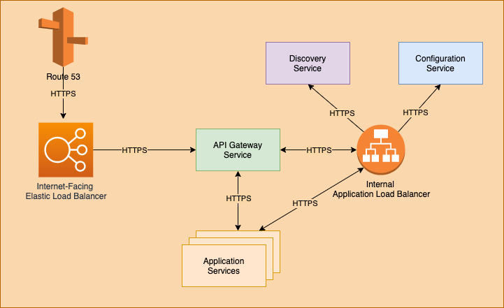

Service Level Architecture View
The financial exchange employs a microservices architecture with independent services interacting with one another to provide a full order management system with a price-time priority orderbook. The figure below shows a high level view of the service level architecture. There are two types of services.

Application Services
Infrastructure Services
The application services implement the business logic of the financial exchange while the infrastructure services support the distributed environment under which the application services run and collaborate with one another.

## AWS Deployment

Similar to the localhost configuration the application properties for each service is configured with the combination of spring profile named aws and the matching atlas-xxxxx-aws.yml in the configuration git repository where xxxxx is the service name.

The AWS deployment architecture is shown in the figure below. Each Application Service and Configuration Service run in a dedicated t2.micro EC2 instance.

## Application Security

There are two parts to application security

Data Encryption
User Authentication & Authorization

