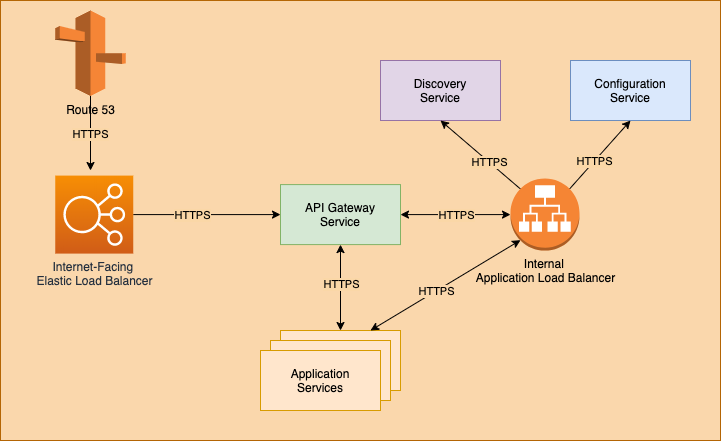

## Introduction

This resource is broken into the two main parts of the solution:

1. Application and Aggregation layers == YCabal / Backbone Cabal
2. Network and Operational Layers == Maidenlane

- YCabal concerns itself with MEV/BEV extraction and other opportunities

- Maidenlane is the execution and routing platform that strategies such as
  YCabal can work on

## YCabal

> Monopolizing transaction flow for arbitrage batching with miner support

This is a strategy that realizes profit by smart transaction batching for the
purposes of arbitrage by controlling transaction ordering.

Right now every user sends a transaction directly to the network mempool and
thus give away the arbitrage, front-running, back-running opportunities to
miners(or random bots).

YCabal creates a virtualized mempool (i.e. a MEV-relay network) that aggregates
transactions (batching), such transactions include:

DEX trades  
Interactions with protocols  
Auctions  
etc  

#### TL;DR - Users can opt in and send transactions to YCabal and in return for

not having to pay for gas for their transaction we batch process it and take the
arbitrage profit from it. Risk by inventory price risk is carried by a Vault,
where Vault depositers are returned the profit the YCabal realizes

## Efficiency by Aggregation

By leveraging batching, miner transaction flow, and providing additional
performant utilities (e.g. faster calculations for finalizing),
we can realize the following potential avenues for realizing profitable
activites:

- Meta Transaction Funtionality
- Order trades in different directions sequentially to produce positive slippage
- Backrun Trades
- Frontrun Trades
- At least 21k in the base cost on every transaction is saved

> **If we have access to transactions before the network we can generate value
> because we can calculate future state, off-chain**

> Think of this as creating a Netting Settlement System (whereas blockchains are
> a real time gross settlement system)

## User Capture

The whole point of Backbone Cabal is to maximize profits from user actions which
gets distributed for free to miners and bots.
We intent to extract this value and provide these profits as `**cashback**` to
users.

**For example**: A SushiSwap trader who loses `X%` to slippage during his trade
can now get `X-Y %` slippage on his trade, because we were able to
_both_ frontrun _and_ backrun their trade and give him the arbitrage profits.

### Service Level Architecture View

The financial exchange employs a microservices architecture with independent services interacting with one another to provide a full order management system with a price-time priority orderbook. The figure below shows a high level view of the service level architecture. There are two types of services.

Application Services
Infrastructure Services
The application services implement the business logic of the financial exchange while the infrastructure services support the distributed environment under which the application services run and collaborate with one another.

## AWS Deployment

Similar to the localhost configuration the application properties for each service is configured with the combination of spring profile named aws and the matching atlas-xxxxx-aws.yml in the configuration git repository where xxxxx is the service name.

The AWS deployment architecture is shown in the figure below. Each Application Service and Configuration Service run in a dedicated t2.micro EC2 instance.

## Application Security

There are two parts to application security

Data Encryption
User Authentication & Authorization

